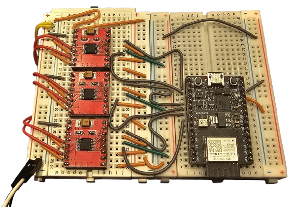

# Spidey Sense
Project submitted to MIT RealityHack 2025. 

<video src="https://github.com/TEAM-PICKLE/SpideySense/blob/main/Images/Projectspideysense.mp4" />

Gain the super power of Spidey Sense!
Project Spidey Sense uses haptic motors - aka spidey sensors - to send spatial data straight to your cranium, no audio-visual cues needed. Our extra-sensory haptic headband lets you **FEEL** anything approaching from any direction.

**Problem Statement**: In XR (Extended Reality) spaces, providing spatial and directional feedback without relying on audio or visual cues presents a significant challenge. As a result, individuals with audio-visual disabilities often struggle to navigate and interact effectively within these environments. The need for a system that communicates distance and direction through alternative sensory channels is essential.

**Motivation**: The motivation behind this project stems from the concept of vehicular communication systems, which measure the proximity between vehicles and potential obstacles or collisions. This idea can be adapted for individuals with audio-visual disabilities in XR spaces. By leveraging haptic feedback as a sensory substitute, we aim to create a system that allows users to perceive spatial relationships and avoid collisions, enhancing their experience and interaction in immersive environments. 

**Objectives**: 
* Provide Haptic Sensory Feedback: To utilize haptic feedback as a mechanism to guide users' awareness towards potential obstacles and target directions. This form of tactile feedback offers a non-visual, non-auditory alternative that can communicate proximity and direction effectively.

* Demonstrate Practical Application: To develop a simple yet impactful technical demonstration that showcases the potential use of haptic feedback for spatial and directional awareness. This demonstration will highlight how the technology can be integrated into XR spaces to assist users with audio-visual disabilities.

A detailed description of components and softwares used can be found in "PROJECT SPIDEY SENSE- Hardware Components and Software Stack.pdf".

## ⚙️ Hardware Requirements
* 3D Printed Hip Hub (CAD Files provided in the "CAD Files" folder).
* [Meta Quest (tested on Meta Quest 3)](https://www.meta.com/quest/quest-3/)
* [ESP32-C3](https://www.digikey.com/en/products/detail/espressif-systems/ESP32-C3-DEVKITM-1U/15198974?gQT=2)
* [DRV8833 Dual DC Motor Driver](https://electropeak.com/drv8833-dual-motor-driver) x3
* [DC Pancake-Style Vibration Motor](https://www.digikey.com/en/products/detail/adafruit-industries-llc/1201/5353637?gQT=1) x6
* [Micro USB Breakout](https://www.sparkfun.com/sparkfun-microb-usb-breakout.html?gQT=1) x2
* [Potentiometer](https://www.digikey.com/en/products/detail/cts-electrocomponents/026TB32R103B1A1/203780)

## 🛠️ Hardware Components
### Hip Hub

### Wiring Diagram - ESP32

### Wiring Diagram - Hip Hub

## 🏷️ License
This repository is released under the MIT license.

## 🙏 Contributors
This work was done by Cheyenne Amil, Max Chen, Mahdiar Edraki, Marie Leung, Yashaswi Prasannakumar.